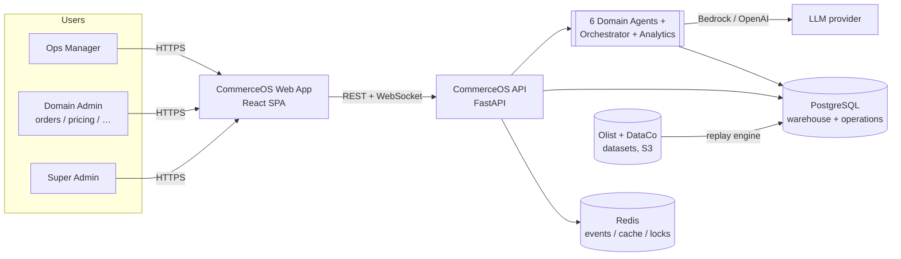
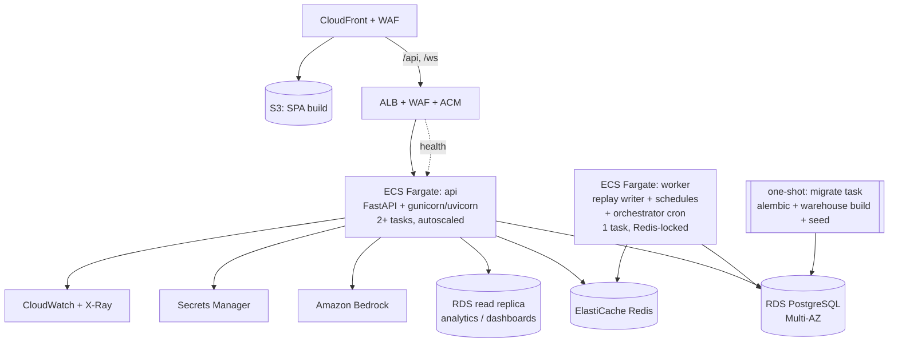
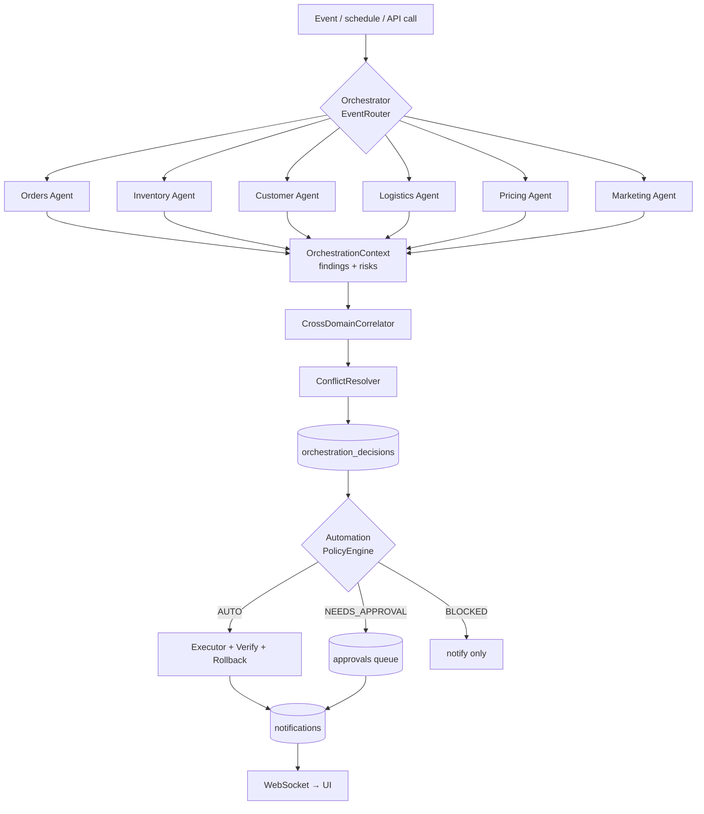
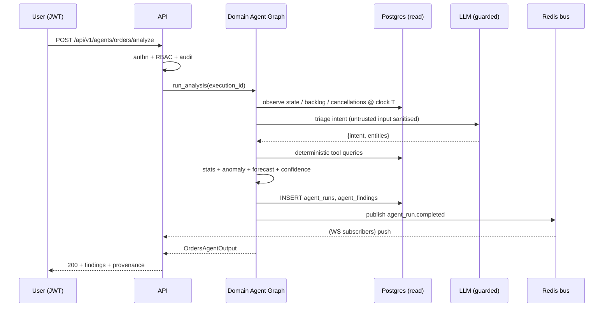

# CommerceOS — Solution Architecture

> Autonomous multi-agent operating system that automates end-to-end e-commerce
> operations: **orders, inventory, customer support, logistics, pricing, marketing**,
> coordinated by an **orchestrator**, with a **text-to-SQL analytics** agent and a
> **human-in-the-loop** approval layer.

---

## 1. Context (C4 level 1)



The data is real historical e-commerce transactions (Olist Brazilian marketplace,
~100k orders 2016–2018; DataCo global supply-chain, ~180k order lines). A
**deterministic replay engine** streams these records into the operational store
at a controllable speed, giving a live "operating a store" simulation with a
well-defined **simulated clock T** — every agent only ever observes records with
`timestamp ≤ T`.

---

## 2. Containers (C4 level 2)



| Container      | Tech                                       | Responsibility                                                                             | Scaling                             |
| -------------- | ------------------------------------------ | ------------------------------------------------------------------------------------------ | ----------------------------------- |
| **Web SPA**    | React 18 + Vite, react-router, react-query | Login, dashboards for each agent, orchestrator command center, approvals, admin            | Static (CloudFront)                 |
| **API**        | FastAPI, SQLAlchemy 2, LangGraph           | Auth, RBAC, agent query/analyze endpoints, WebSocket fan-out, dashboard aggregation        | ECS target-tracking (CPU + ALB RPS) |
| **Worker**     | asyncio / arq                              | Single-writer replay engine, scheduled per-agent analyses, orchestrator cron, housekeeping | Fixed 1 (Redis `SET NX` lock)       |
| **PostgreSQL** | RDS PG 15                                  | Operational + warehouse tables                                                             | Multi-AZ + read replica             |
| **Redis**      | ElastiCache                                | Event bus (pub/sub → WS), cache, rate-limit buckets, replay state, distributed lock        | Single primary + replica            |

---

## 3. Components — the agent runtime



Each **domain agent** is a `langgraph.StateGraph`:

```
observe (live DB @ clock T)
  → triage / plan (LLM intent + entity extraction, or heuristic)
  → execute deterministic tools  (LangChain @tool + app/intelligence/*)
  → analyse evidence
  → detect anomalies  (modified z-score / Tukey fences / MAD)
  → forecast          (OLS / Holt-Winters / STL)
  → assess risk       (sample-size-aware confidence)
  → recommend         (with automation_eligibility)
  ↺ bounded self-correction loop (≤ 3)
  → persist agent_run + agent_findings, emit event
```

**The LLM never does arithmetic.** It classifies intent, extracts entities,
synthesises natural-language answers, and (analytics agent only) generates SQL.
All numbers come from `app/intelligence/*` and SQL aggregates.

The **analytics agent** is a separate NL→SQL graph (pattern: `sql-agent`):
`reformulate → classify (simple/complex/out-of-scope) → CoT plan → generate
(few-shot) → execute (read-only role + AST guard + statement_timeout + row cap)
→ self-correct ≤ 3 → summarise + pick chart type`.

---

## 4. Sequence — an agent analysis via the API



---

## 5. Data flow — ingestion / replay

1. **Warehouse build** (`scripts/build_warehouse.py`, one-shot): load all Olist +
   DataCo CSVs from S3 into Postgres, idempotent, checksummed manifest.
2. **Index** (`replay_engine.index_events_from_datasets`): sort every order event
   chronologically in memory (worker only).
3. **Replay** (worker `_run_loop`, Redis-locked): advance the simulated clock,
   batch-insert the next slice of orders/items, decrement `inventory`, append
   `stock_movements`, publish `ORDER_CREATED` events to Redis.
4. **State** (`status`, `speed`, `current_index`, `simulated_date`) lives in Redis
   → survives restarts, single authoritative writer, readable by all api tasks.
5. **Agents** read only `timestamp ≤ simulated_date`.

---

## 6. Security architecture

- **AuthN:** JWT (HS256, `python-jose`), bcrypt password hashing, access + refresh.
- **AuthZ:** RBAC — 7 roles (`SUPER_ADMIN` + one per domain). Read = any
  authenticated user; agent controls / simulation / user admin = matching admin
  or super-admin. Every route except `/health*` and `/api/v1/auth/login` requires a token.
- **Audit:** append-only `audit_logs`, one row per authenticated mutation +
  explicit security events; shipped to CloudWatch; SUPER_ADMIN read API.
- **Analytics SQL safety:** dedicated `commerceos_ro` Postgres role (SELECT only)
  on the read replica; `sqlparse` AST guard (single `SELECT`/`WITH`, no
  `pg_*`/`information_schema` mutation, no multi-statement); `statement_timeout`;
  hard row cap.
- **LLM guardrails:** per-call timeout + retry + circuit breaker; token/USD budget;
  prompt-injection stripping on untrusted text; PII scrub before logging;
  structured-output pydantic validation.
- **Transport:** HTTPS only (ACM), HSTS, security headers, WAF managed rules +
  rate rule on ALB and CloudFront.
- **Secrets:** Secrets Manager only; nothing in the repo; `detect-secrets` in CI.
- **Network:** RDS + Redis in private subnets, no IGW route; VPC endpoints for AWS APIs.
- **Automation:** financial actions and bulk customer comms are always
  `BLOCKED`/`NEEDS_APPROVAL` regardless of model confidence (ADR 0006).

Full detail: `docs/security.md`.

---

## 7. Observability

| Signal  | Implementation                                                                                                                                                                                                  |
| ------- | --------------------------------------------------------------------------------------------------------------------------------------------------------------------------------------------------------------- |
| Logs    | structlog JSON, `request_id` + `correlation_id` + `execution_id` on every line → CloudWatch                                                                                                                     |
| Metrics | `prometheus-fastapi-instrumentator` `/metrics`; custom: `agent_run_total`, `agent_run_latency_seconds`, `llm_tokens_total`, `llm_cost_usd_total`, `replay_lag_events`, `ws_connections` → CloudWatch (EMF/ADOT) |
| Traces  | OpenTelemetry → ADOT sidecar → X-Ray; one trace per agent run with node + SQL + LLM spans                                                                                                                       |
| Health  | `/health` (liveness), `/health/ready` (DB write + DB read + Redis + LLM ping)                                                                                                                                   |
| Alarms  | 5xx rate, p95 latency, agent-failure rate, replay lag, RDS CPU/conns, Redis mem, LLM $/day → SNS                                                                                                                |
| Cost    | daily LLM-cost rollup → budget alarm at `LLM_MONTHLY_BUDGET_USD`                                                                                                                                                |

---

## 8. Environments

|                | dev                                  | prod                                    |
| -------------- | ------------------------------------ | --------------------------------------- |
| RDS            | single-AZ `db.t4g.micro`, no replica | Multi-AZ `db.t4g.medium` + read replica |
| Redis          | `cache.t4g.micro`                    | `cache.t4g.small` + replica             |
| ECS api        | 1 task (0.5 vCPU / 1 GB)             | 2–6 tasks (1 vCPU / 2 GB)               |
| ECS worker     | 1 task                               | 1 task                                  |
| NAT            | single                               | one per AZ                              |
| Docs (`/docs`) | on                                   | off                                     |
| LLM            | `deterministic` or OpenAI dev key    | Bedrock                                 |

---

## 9. Key decisions

See `docs/adr/`:
0001 AWS · 0002 PostgreSQL · 0003 LLM provider abstraction ·
0004 canonical monorepo · 0005 LangGraph + orchestrator · 0006 HITL automation.
